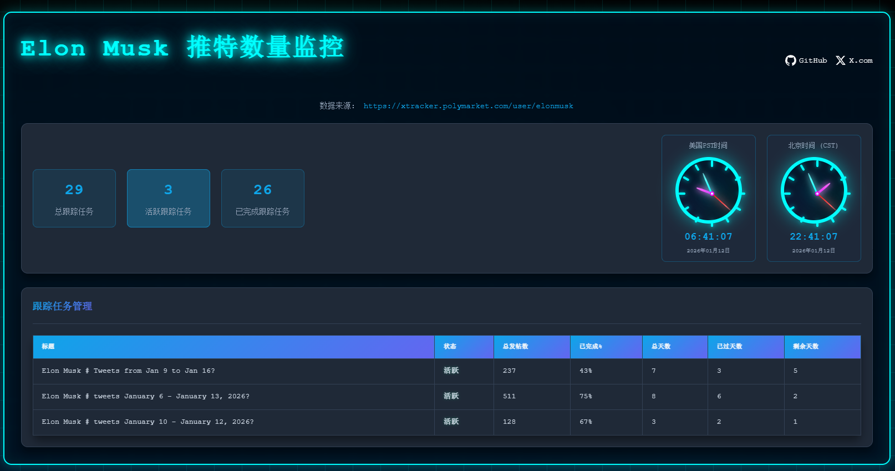
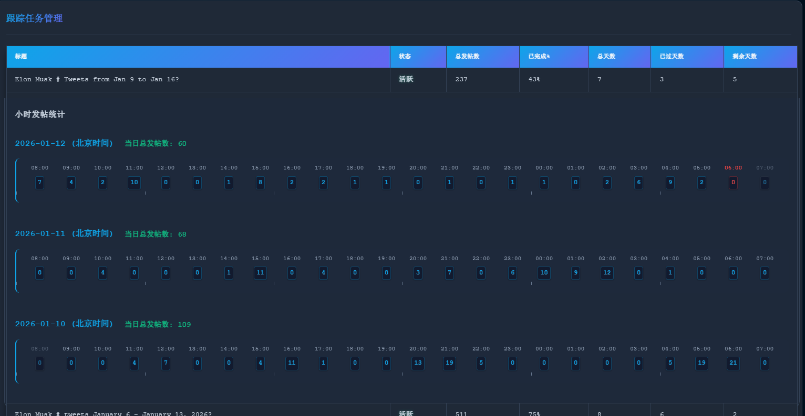

# Polymarket Elon Tracker

用于跟踪和监控Elon Musk在Polymarket上的预测市场数据的Flask应用

## 项目概述

Polymarket Elon Tracker是一个基于Flask的Web应用，用于实时跟踪和监控Elon Musk在Polymarket平台上的各种预测市场数据。该应用通过定时从外部API获取数据，将其存储到数据库中，并提供RESTful API和Web界面供用户访问和可视化数据。

## 功能特点

- 📊 **实时数据跟踪**：定时从xtracker.polymarket.com获取Elon Musk的跟踪数据
- 💾 **数据持久化**：将所有数据存储到SQLite数据库中，便于历史查询和分析
- 🌐 **RESTful API**：提供完整的API接口，方便第三方应用集成
- 🎨 **Web管理界面**：直观的前端界面，便于查看和管理跟踪数据
- ⏰ **实时数据更新**：30秒自动更新一次数据，确保数据的时效性
- 🔄 **变化检测**：自动检测数据变化，并记录变化历史
- 📈 **统计数据可视化**：提供统计数据的可视化展示

## 系统截图

### 主界面



展示了系统的主要监控界面，包括总跟踪任务统计、双时钟显示和跟踪任务列表。

### 小时级统计



展示了小时级别的发帖统计数据，包括不同日期的小时发帖量柱状图。

## 技术栈

### 后端
- **Python 3.x** - 主要开发语言
- **Flask** - Web应用框架
- **APScheduler** - 定时任务调度
- **SQLite** - 轻量级数据库
- **Requests** - HTTP请求库

### 前端
- **HTML5** - 页面结构
- **CSS3** - 样式设计
- **JavaScript** - 交互逻辑
- **Chart.js** - 数据可视化（推测，基于常见前端可视化库）

## 项目结构

```
polymarket-elon/
├── app.py                 # 主应用文件，包含Flask路由和定时任务
├── database.py            # 数据库操作模块
├── requirements.txt       # 项目依赖列表
├── polymarket.db          # SQLite数据库文件
├── html/                  # 前端文件目录
│   ├── elon.html          # 主页面
│   ├── index.html         # 索引页面
│   └── static/            # 静态资源目录
│       ├── css/           # 样式文件目录
│       │   └── style.css  # 主样式文件
│       └── js/            # JavaScript文件目录
│           ├── clock.js   # 时钟功能
│           └── elon.js    # 主交互逻辑
└── .gitignore             # Git忽略文件配置
```

## 安装和运行

### 环境要求
- Python 3.6或更高版本
- Git（用于克隆项目）

### 安装步骤

1. **克隆项目**
   ```bash
   git clone https://github.com/lyglcheng/polymarket-elon.git
   cd polymarket-elon
   ```

2. **创建虚拟环境（可选但推荐）**
   ```bash
   python -m venv venv
   # Windows
   venv\Scripts\activate
   # macOS/Linux
   source venv/bin/activate
   ```

3. **安装依赖**
   ```bash
   pip install -r requirements.txt
   ```

4. **运行应用**
   ```bash
   python app.py
   ```

5. **访问应用**
   - Web界面：http://localhost:8085
   - API端点：http://localhost:8085/api/

## API文档

### 1. 获取所有跟踪数据
- **URL**：`/api/trackings`
- **方法**：`GET`
- **响应**：
  ```json
  {
    "success": true,
    "data": [
      {
        "id": "tracking_id",
        "title": "跟踪标题",
        "isActive": true,
        "isComplete": false,
        // 其他跟踪数据字段
      }
    ]
  }
  ```

### 2. 获取特定跟踪的统计数据
- **URL**：`/api/trackings/<tracking_id>/stats`
- **方法**：`GET`
- **参数**：
  - `tracking_id`：跟踪任务的唯一标识符
- **响应**：
  ```json
  {
    "success": true,
    "data": {
      "tracking_id": "tracking_id",
      "cumulative": 100,
      "count": 10,
      // 其他统计数据字段
    }
  }
  ```

### 3. 获取统计摘要
- **URL**：`/api/stats/summary`
- **方法**：`GET`
- **响应**：
  ```json
  {
    "success": true,
    "data": {
      "total": 20,
      "active": 15,
      "inactive": 5,
      // 其他摘要数据
    }
  }
  ```

### 4. 获取小时级别的统计数据
- **URL**：`/api/trackings/<tracking_id>/hourly`
- **方法**：`GET`
- **参数**：
  - `tracking_id`：跟踪任务的唯一标识符
- **响应**：
  ```json
  {
    "success": true,
    "data": [
      {
        "hour": "2023-01-01T12:00:00",
        "cumulative": 50,
        // 其他小时级数据
      }
    ]
  }
  ```

### 5. 检查数据更新
- **URL**：`/api/check-updates`
- **方法**：`GET`
- **响应**：
  ```json
  {
    "success": true,
    "last_update_time": 1640995200,
    "current_time": 1640995230
  }
  ```

### 6. 获取最新数据（带变化检测）
- **URL**：`/api/latest-data`
- **方法**：`GET`
- **响应**：
  ```json
  {
    "success": true,
    "data_changed": true,
    "data": {
      "trackings": [...],
      "summary": {...},
      "last_update": 1640995230,
      "changes": [
        {
          "tracking_id": "tracking_id",
          "title": "跟踪标题",
          "previous_cumulative": 90,
          "current_cumulative": 100,
          "change": 10
        }
      ]
    }
  }
  ```

## 项目架构

### 后端架构

1. **Flask应用层**：处理HTTP请求和响应
2. **API层**：提供RESTful API接口
3. **业务逻辑层**：处理数据处理和业务规则
4. **数据访问层**：与数据库交互
5. **定时任务层**：定期从外部API获取数据

### 定时任务

- **check_incomplete_trackings**：每30秒检查一次未完成的跟踪任务
- **update_external_data**：每30秒从外部API获取数据并更新数据库

### 数据流程

1. 定时任务 `update_external_data` 从 `xtracker.polymarket.com` 获取Elon Musk的跟踪数据
2. 获取到的数据存储到 `polymarket.db` SQLite数据库中
3. Web界面通过API请求获取数据
4. 前端JavaScript将数据可视化展示
5. 用户可以通过Web界面查看和管理跟踪数据

## 数据库设计

### 主要表结构

#### trackings表
- 存储跟踪任务的基本信息
- 字段：id, title, isActive, isComplete, createdAt, updatedAt, 等

#### stats表
- 存储跟踪任务的统计数据
- 字段：id, tracking_id, cumulative, count, createdAt, updatedAt, 等

#### hourly_stats表
- 存储小时级别的统计数据
- 字段：id, tracking_id, hour, cumulative, count, 等

## 配置说明

### 应用配置

在 `app.py` 文件中可以配置以下参数：

- `SCHEDULER_API_ENABLED`：是否启用调度器API
- `SCHEDULER_TIMEZONE`：调度器时区（默认为'Asia/Shanghai'）
- 定时任务的执行间隔（默认为30秒）

### 外部API配置

- `user_handle`：要跟踪的用户handle（默认为'elonmusk'）
- 外部API地址：`https://xtracker.polymarket.com/api/`

## 开发指南

### 代码风格

- 遵循PEP 8 Python代码风格指南
- 使用清晰的变量和函数命名
- 添加必要的注释

### 开发流程

1. 克隆项目到本地
2. 创建并激活虚拟环境
3. 安装依赖
4. 运行应用进行开发测试
5. 提交代码前确保通过所有测试

### 测试

目前项目没有集成测试框架，建议通过以下方式进行测试：

- 运行应用并访问Web界面，检查功能是否正常
- 使用API测试工具（如Postman）测试API接口
- 检查日志输出，确保没有错误信息

## 部署说明

### 本地部署

参考「安装和运行」部分的说明

### 生产环境部署

建议使用以下方式部署到生产环境：

1. 使用Gunicorn作为WSGI服务器
2. 使用Nginx作为反向代理
3. 配置SSL证书，启用HTTPS
4. 设置定时备份数据库
5. 配置日志记录

## 贡献指南

欢迎提交Issue和Pull Request！

### 提交Issue

1. 清晰描述问题或建议
2. 提供必要的上下文信息
3. 如果是bug，请提供复现步骤

### 提交Pull Request

1. Fork项目
2. 创建功能分支
3. 提交代码
4. 确保代码符合项目风格
5. 提交Pull Request，描述变更内容

## 许可证

MIT License - 详见LICENSE文件

## 联系方式

- 项目地址：https://github.com/lyglcheng/polymarket-elon
- 作者：lyglcheng
- 邮箱：lyglcheng@gmail.com

## 更新日志

### v1.0.0 (2026-01-12)

- 初始版本发布
- 实现基本的跟踪和监控功能
- 提供RESTful API接口
- 实现Web管理界面
- 支持实时数据更新和变化检测

## 致谢

- [Polymarket](https://polymarket.com/) - 提供预测市场数据
- [Flask](https://flask.palletsprojects.com/) - Web应用框架
- [APScheduler](https://apscheduler.readthedocs.io/) - 定时任务调度库
- [SQLite](https://www.sqlite.org/) - 轻量级数据库

---

**Polymarket Elon Tracker** - 实时跟踪Elon Musk在Polymarket上的预测市场数据